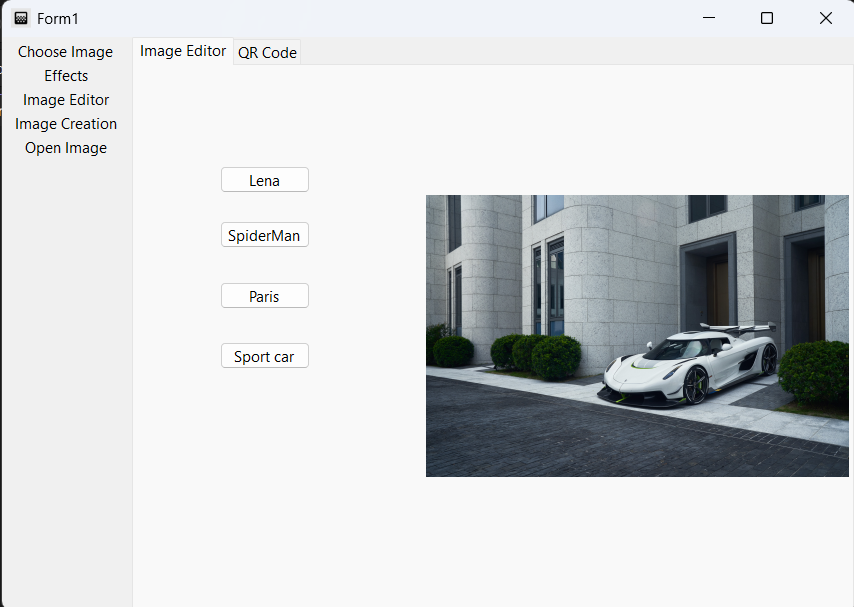
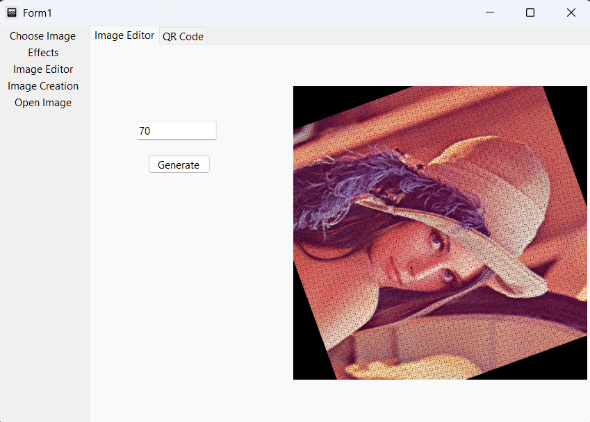
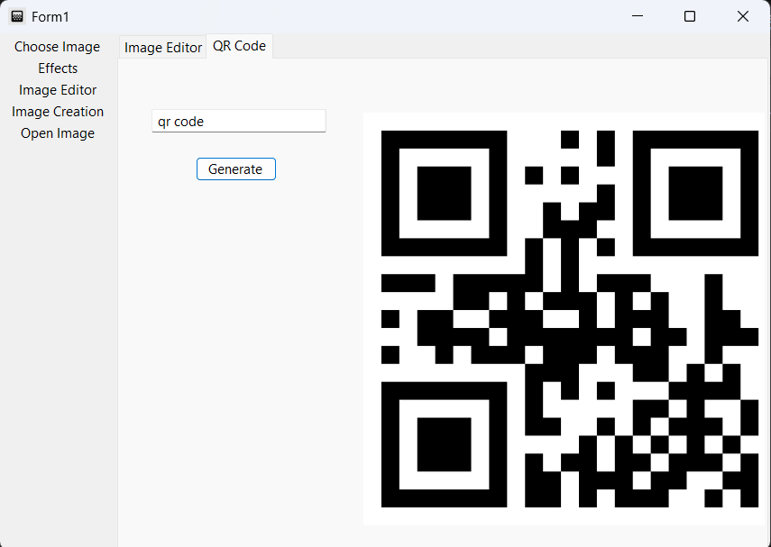
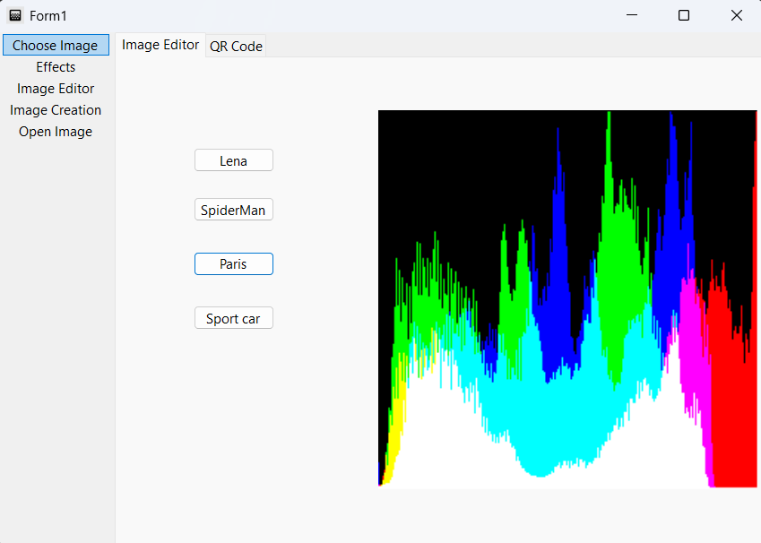
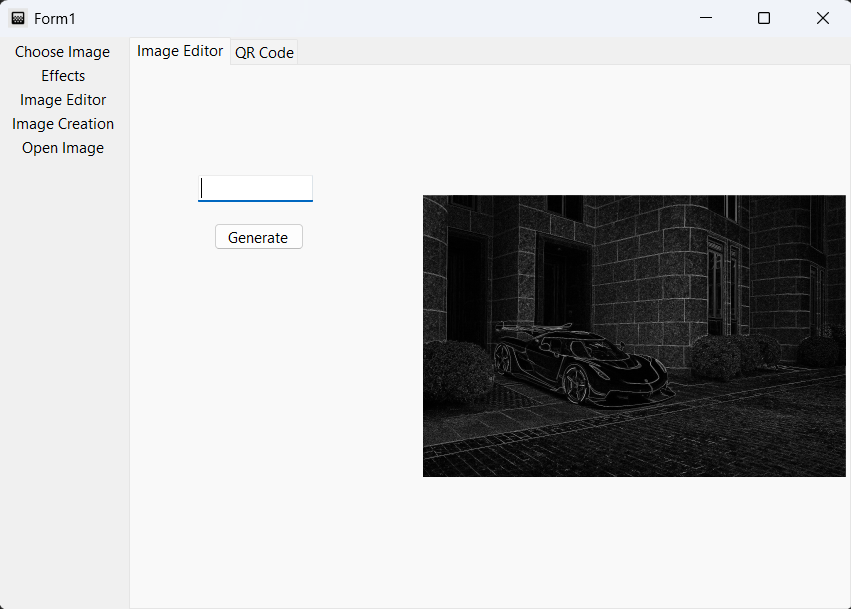
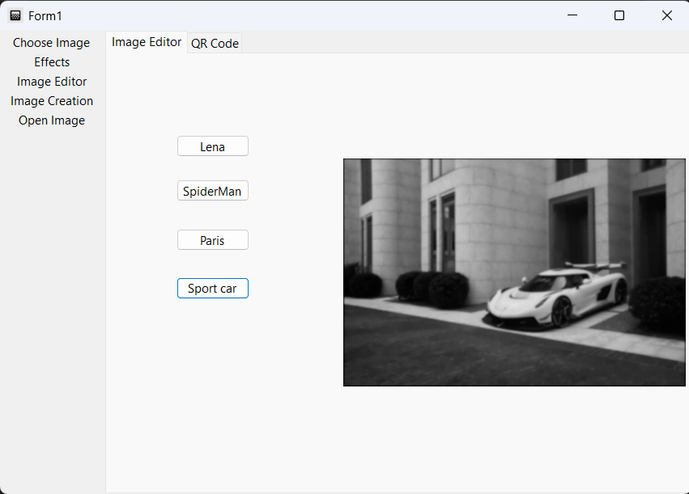

# ImageEditor

This WPF C# Desktop application is an image editor and qr code generator. 

This project was created as a 2nd year engineering project and algorithm exercice. 

## Quick start

It the release section an exe file is available. 

## Features

- import your image or choose among the high quality sample ones
- generate text as QR codes
- apply various image filters (black and white, greyscale, negative, blur)
- apply transformations (rotation, scaling, mirror, shear)
- convolution matrix (edge detection, sharpness, blur)
- compute color and luminosity histograms
- generate fractals

## Screenshots

